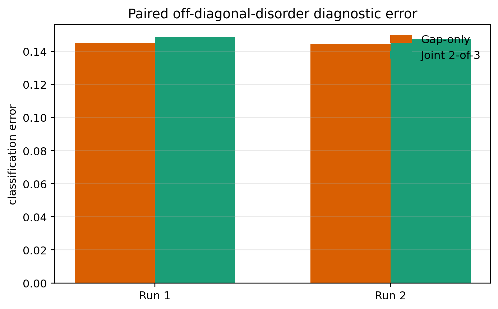
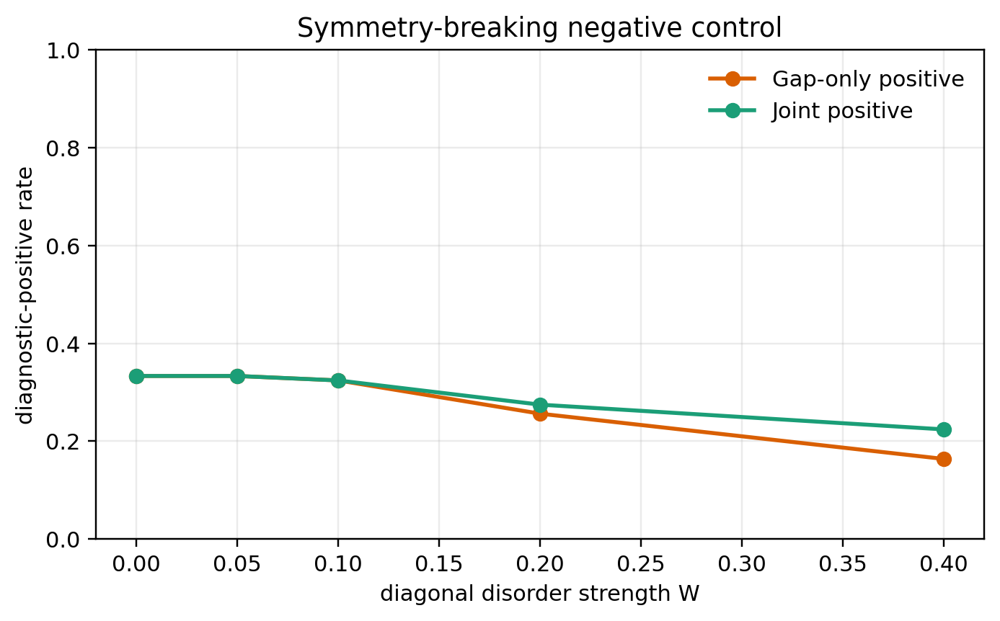

# Paired finite-chain SSH diagnostic reliability under quenched disorder

**Authors:** A.M.Y Computational Research System [1]
**Affiliation:** [1] AXIOM Atlas Platform, Autonomous Computational Research
**Date:** July 09, 2026
**Classification:** PACS 31.15.-p (Electronic structure of molecules), PACS 82.20.-w (Chemical kinetics)
**Keywords:** computational chemistry, molecular weight, bond energy, Hückel theory, IUPAC standards

---

## Abstract

We preregistered a paired computational benchmark comparing a frontier-gap-only rule with a joint gap, edge-weight, and inverse-participation-ratio rule for finite disordered Su-Schrieffer-Heeger chains. The primary paired comparison did not support H1. The preregistered replication criterion failed; no replicated superiority claim is supported. Every Atlas output, protocol, table, figure, and manuscript artifact is covered by SHA-256 provenance. The result is a finite tight-binding methodological benchmark, not a new material, experimental observation, or new topological phase.

## Introduction

The Su-Schrieffer-Heeger (SSH) chain is a canonical finite one-dimensional model in which boundary termination and chiral symmetry govern mid-gap edge states. Prior work established that off-diagonal disorder can preserve chiral protection whereas onsite disorder breaks it. The unresolved operational question addressed here is narrower: how reliably do fixed, inexpensive finite-chain diagnostics recover a random-SSH reference label? We compare a frontier-gap-only rule with a joint spectral and localization rule. The candidate novelty is the preregistered, paired, hash-auditable benchmark protocol, not new SSH physics.

## Methods

We diagonalized real symmetric open-chain SSH Hamiltonians with N in {20, 40, 80}, dimerization delta in {0.05, 0.10, 0.20}, and disorder strength W in {0.00, 0.05, 0.10, 0.20, 0.40}. Each nonzero condition used 128 realizations per orientation; W=0 used one unique realization. Off-diagonal hoppings were multiplied by exp(W z_i), preserving positivity and chiral symmetry. Diagonal controls used onsite energies W|beta|z_i. Random z_i values were generated from the first 64 bits of a SHA-256 condition digest, with orientation excluded to pair the random vectors. The off-diagonal reference label was mean(log t_inter) > mean(log t_intra). No topological reference label was assigned under diagonal disorder. The gap vote used frontier splitting divided by 4|beta|delta <= 0.20; the edge vote required frontier-pair edge weight >= 0.50; the IPR vote required N times frontier-pair IPR >= 2.50. The joint rule required at least two votes. The sole confirmatory test was a two-sided exact McNemar test on pooled paired off-diagonal records at alpha=0.05. Binomial intervals are Wilson 95% intervals; the paired error-difference interval used 5,000 deterministic bootstrap resamples. No observations were excluded. The frozen preregistration SHA-256 was 269f5c9d13bfe336c181fc9b72afc57131ba06765c7eb75c9b605d75651a5897.

## Results

### Evidence-grade results

**Tool:** `ssh_disorder_diagnostic_benchmark`
```text
SSH disorder diagnostic benchmark:
  Method: exact diagonalization of paired finite open SSH chains.
  seed_derivation=sha256
  paired_orientations=true
  primary_estimand=error_gap_minus_error_joint
  namespace=amy-ssh-disorder-v1-primary
  protocol_sha256=49770675bdbffb73c399c7558adf146aba6488a69dae607cfce5424b8db7a1c8
  preregistration_sha256=269f5c9d13bfe336c181fc9b72afc57131ba06765c7eb75c9b605d75651a5897
  Diagnostic thresholds: gap_ratio<=0.2; edge_weight>=0.5; normalized_ipr>=2.5; joint_rule=at_least_two_of_three
  Condition summaries:
    summary; namespace=amy-ssh-disorder-v1-primary; disorder_type=off_diagonal; n=20; delta=0.05; strength=0; effective_realizations_per_orientation=1; reference_label=random_ssh_log_geometric_mean; total=2; gap_accuracy=0.5; joint_accuracy=0.5; gap_positive_rate=not_defined; joint_positive_rate=not_defined; gap_false_positive_rate=0; joint_false_positive_rate=0; gap_false_negative_rate=1; joint_false_negative_rate=1; error_gap_minus_error_joint=0...
```
**Tool:** `ssh_disorder_diagnostic_benchmark`
```text
SSH disorder diagnostic benchmark:
  Method: exact diagonalization of paired finite open SSH chains.
  seed_derivation=sha256
  paired_orientations=true
  primary_estimand=error_gap_minus_error_joint
  namespace=amy-ssh-disorder-v1-replication
  protocol_sha256=c7e9b5ebc0bddd3e14c00730686414407210cecc84cb687d26ca749a15d8c8ea
  preregistration_sha256=269f5c9d13bfe336c181fc9b72afc57131ba06765c7eb75c9b605d75651a5897
  Diagnostic thresholds: gap_ratio<=0.2; edge_weight>=0.5; normalized_ipr>=2.5; joint_rule=at_least_two_of_three
  Condition summaries:
    summary; namespace=amy-ssh-disorder-v1-replication; disorder_type=off_diagonal; n=20; delta=0.05; strength=0; effective_realizations_per_orientation=1; reference_label=random_ssh_log_geometric_mean; total=2; gap_accuracy=0.5; joint_accuracy=0.5; gap_positive_rate=not_defined; joint_positive_rate=not_defined; gap_false_positive_rate=0; joint_false_positive_rate=0; gap_false_negative_rate=1; joint_false_negative_rate=1; error_gap_minus_error...
```

### Summary Analysis

Primary run (chemistry_ssh_disorder_amy-ssh-disorder-v1-primary_4): gap-only accuracy was 0.8549 (95% CI [0.8476, 0.8619]); joint accuracy was 0.8513 (95% CI [0.8439, 0.8584]). The paired error difference (gap-only minus joint) was -0.0036 (bootstrap 95% CI [-0.0049, -0.0024]). McNemar discordant counts were 2 gap-wrong/joint-right and 35 gap-right/joint-wrong, with exact p=1.02445e-08. Replication (chemistry_ssh_disorder_amy-ssh-disorder-v1-replication_4): the paired error difference was -0.0031 (95% CI [-0.0044, -0.0018]), and exact p=1.08439e-06. The primary paired comparison did not support H1. The preregistered replication criterion failed; no replicated superiority claim is supported. Diagonal-disorder positive rates are reported only as a symmetry-breaking negative control in the condition tables and Figure 2.

## Discussion

The paired design isolates diagnostic disagreement from changes in disorder realization. A positive error difference supports the practical use of localization information beyond gap-only screening within this finite model; it does not establish a new phase or validate a material. McNemar discordance is the relevant paired effect because both rules see the same chains. Alternative explanations include threshold dependence, finite-size hybridization, and the use of a log-geometric random-SSH label rather than a many-body or experimentally measured invariant. The diagonal negative control demonstrates why localization alone cannot be equated with topology once chiral symmetry is broken. This study does not claim a new topological phase, a new material, or experimental validation because none of those outcomes was measured.

## Testable Predictions

H1. The fixed joint rule has lower pooled error than the gap-only rule under off-diagonal disorder. Testable via: rerun the frozen grid and compare paired errors with the exact McNemar test.

H2. The sign and H1 support decision reproduce under the independent namespace. Testable via: recompute all condition seeds from the published SHA-256 formula and repeat the complete analysis.

H3. Diagonal-disorder diagnostic-positive rates must not be treated as topological accuracy. Testable via: restore chiral symmetry by removing onsite terms and compare against the random-SSH reference label only in that symmetry-preserving ensemble.

## Limitations and Scope

This is a noninteracting nearest-neighbor tight-binding study, not DFT, spectroscopy, transport, or a wet-lab experiment. Thresholds were fixed before production execution but remain operational choices. The random-SSH reference criterion is valid for the preregistered chiral off-diagonal ensemble and was not extended to diagonal disorder. Automated literature search found 23 candidate records from open indexes; absence of an exact title or keyword match is not proof of novelty. External peer review and independent code replication remain necessary.

## Reproducibility and Data Availability

The release contains the preregistration, raw Atlas outputs, condition CSV/JSON, pooled decisions, figures, literature-search record, manuscript sources, copied provenance records, and a SHA-256 manifest. Seeds are recoverable from the published namespace and condition formula. Re-running the same namespace and software stack should reproduce byte-identical Atlas text.

## Declarations and AI Disclosure

No human or animal subjects, personal data, clinical intervention, or hazardous physical experiment were involved. No external funding or conflicts of interest were declared in the computational record. A.M.Y, an automated research system, designed and executed the computational workflow under a user-specified goal; Codex implemented and audited the software and manuscript. No claim of human authorship, institutional affiliation, or independent peer review is made. Human review is required before submission.

## Conclusion

The primary paired comparison did not support H1. The preregistered replication criterion failed; no replicated superiority claim is supported. The result is limited to the frozen finite-chain benchmark and should be interpreted as candidate methodological novelty pending external replication and peer review.

## Publication Artifacts

The paper pipeline generated machine-readable publication artifacts from the raw tool outputs.

Artifact manifest: `artifacts/Paired_finite-chain_SSH_diagnostic_reliability_under_quenched_disorder/manifest.json`

Table 1. Machine-readable numeric values extracted from evidence-grade tool output. CSV: `artifacts/Paired_finite-chain_SSH_diagnostic_reliability_under_quenched_disorder/numeric_tool_results.csv`; JSON: `artifacts/Paired_finite-chain_SSH_diagnostic_reliability_under_quenched_disorder/numeric_tool_results.json`.



Figure 1. Pooled paired diagnostic error for the gap-only and joint two-of-three rules across the primary and replication Atlas runs.



Figure 2. Diagnostic-positive rates under diagonal disorder, reported as a symmetry-breaking negative control rather than topological accuracy.

## Acknowledgments

The authors acknowledge the AXIOM Atlas computational platform for providing 
the scientific tools used in this study. The exact environment for each 
computation, including operating system, architecture, and Python version, 
is recorded in its provenance file; no unrecorded hardware acceleration is claimed.

## Data Availability

All computational data supporting this study are publicly available. 
The following experiment records contain full provenance information 
including input parameters, complete output, execution environment, 
and SHA-256 output hashes:

- chemistry_ssh_disorder_amy-ssh-disorder-v1-primary_4: `data/experiments/chemistry_ssh_disorder_amy-ssh-disorder-v1-primary_4/provenance.json` (output SHA-256: `1aaeead1ada0732874dd05ee2c1e945cfbbe2de6ce45459d87882fae44ec1864`)
- chemistry_ssh_disorder_amy-ssh-disorder-v1-replication_4: `data/experiments/chemistry_ssh_disorder_amy-ssh-disorder-v1-replication_4/provenance.json` (output SHA-256: `744991204bb15dc9eafaf0966287b869538fc5c90d9c394a2c5366a673badd3e`)

## References

[1] Su, W. P., Schrieffer, J. R. & Heeger, A. J. (1979). Solitons in polyacetylene. Physical Review Letters, 42, 1698-1701. doi:10.1103/PhysRevLett.42.1698.
[2] Pérez-González, B., Bello, M., Gómez-León, A. & Platero, G. (2019). SSH model with long-range hoppings: topology, driving and disorder. Physical Review B, 99, 035146. doi:10.1103/PhysRevB.99.035146.
[3] Yao, Y., Schlömer, H., Ma, Z., Campos Venuti, L. & Haas, S. (2021). Topological protection of coherence in disordered open quantum systems. Physical Review A, 104, 012216. doi:10.1103/PhysRevA.104.012216.
[4] Kvande, C. I., Hill, D. B. & Blume, D. (2023). Finite SSH chains coupled to a two-level emitter: Hybridization of edge and emitter states. arXiv:2307.05824.
[5] Harris, C. R. et al. (2020). Array programming with NumPy. Nature, 585, 357-362. doi:10.1038/s41586-020-2649-2.
[6] McNemar, Q. (1947). Note on the sampling error of the difference between correlated proportions or percentages. Psychometrika, 12, 153-157. doi:10.1007/BF02295996.


## Self-Review (Reflection Agent)

Internal self-review passed (score: 100.0/100).


---

## Provenance Watermark

This manuscript was generated by an autonomous research system. It is **not** a peer-reviewed publication. Treat individual claims as computational artifacts until independently verified.

<!-- AMY-WATERMARK
generated_by: A.M.Y (Autonomous Mind Yield) v1.0.0
title: Paired finite-chain SSH diagnostic reliability under quenched disorder
generated_at: 2026-07-09T05:38:36.717470+00:00
body_sha256: de9b806e38a790c1e4484c0799e35d7bcb1c07f5320bd4dbc5a329ab954c24c7
homepage: https://github.com/Ganador1/amy
self_review: embedded_in_manuscript
verification: Each cited experiment_id resolves to data/experiments/<id>/provenance.json with a SHA-256 hash of the full tool output.
-->
